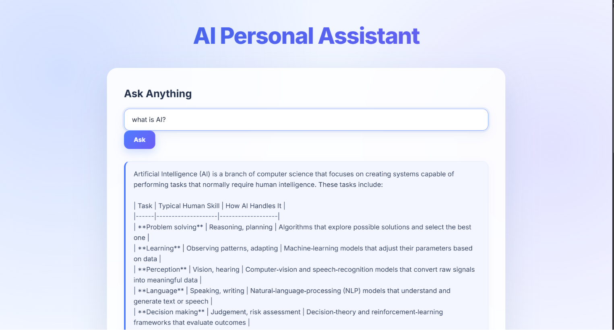
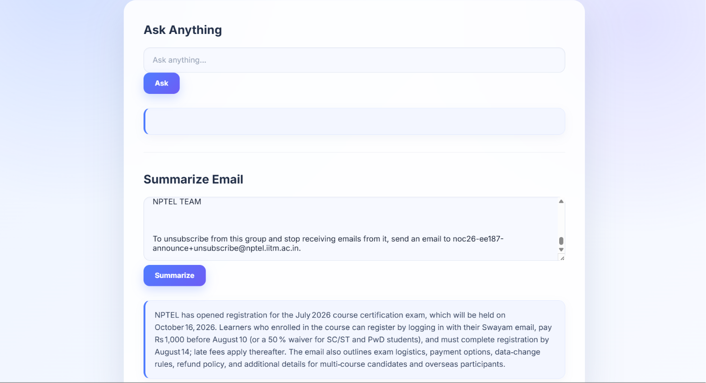

# 🤖 AI Personal Assistant

An AI-powered web application built with **Python, Flask, Groq API,
HTML, CSS, and JavaScript**.

The application provides two main features:

-   💬 **Ask Anything** --- Ask questions and receive AI-generated
    responses.
-   📧 **Summarize Email** --- Paste an email and get a concise 2--3
    sentence summary.

------------------------------------------------------------------------

## ✨ Features

### 💬 Ask Anything

Users can enter any question through the web interface. The Flask
backend sends the question to the Groq API and returns the AI response.

### 📧 Email Summarizer

Users can paste email content into the application and receive an
AI-generated summary.

### ⚡ Fast API Communication

The frontend uses JavaScript `fetch()` to communicate with Flask
endpoints without refreshing the page.

### 🎨 Modern User Interface

The application includes a responsive, modern UI with a gradient
background, glass-style card, styled inputs, buttons, and AI response
sections.

------------------------------------------------------------------------

## 🛠️ Technologies Used

  Technology          Purpose
  ------------------- -----------------------------------------
  Python              Backend programming
  Flask               Web framework and API routes
  Groq API            AI/LLM responses
  OpenAI Python SDK   OpenAI-compatible client used with Groq
  HTML                Web page structure
  CSS                 UI styling
  JavaScript          Frontend API requests
  Jinja2              Flask template rendering
  python-dotenv       Environment variable management

------------------------------------------------------------------------

## 🏗️ Project Architecture

``` text
User
  ↓
HTML / CSS / JavaScript
  ↓
Flask Backend
  ↓
Groq API
  ↓
LLM Model
  ↓
AI Response
  ↓
Flask JSON Response
  ↓
Web Interface
```

------------------------------------------------------------------------

## 📁 Project Structure

``` text
ai-personal-assistant-flask/
│
├── main.py
├── requirements.txt
├── .gitignore
├── README.md
│
├── templates/
│   └── index.html
│
└── static/
    └── style.css
```

> Keep your `.env` file local. Do **not** upload API keys to GitHub.

------------------------------------------------------------------------

## 🔑 Environment Variables

Create a `.env` file in the project root:

``` env
GROQ_API_KEY=your_groq_api_key_here
```

Never publish your real API key.

------------------------------------------------------------------------

## 🚀 How to Run Locally

### 1. Clone the repository

``` bash
git clone https://github.com/YOUR_USERNAME/ai-personal-assistant-flask.git
cd ai-personal-assistant-flask
```

### 2. Create a virtual environment

``` bash
python -m venv venv
```

### 3. Activate the virtual environment

**Windows:**

``` bash
venv\Scripts\activate
```

### 4. Install dependencies

``` bash
pip install -r requirements.txt
```

### 5. Add your API key

Create `.env`:

``` env
GROQ_API_KEY=your_groq_api_key_here
```

### 6. Run the application

``` bash
python main.py
```

Open the local Flask URL shown in the terminal, typically:

``` text
http://127.0.0.1:5000
```

------------------------------------------------------------------------

## 📸 Screenshots

### AI Assistant --- Ask Anything



### Email Summarizer



> Add your screenshots inside a `screenshots/` folder using the
> filenames above.

------------------------------------------------------------------------

## 🔌 API Endpoints

### `GET /`

Loads the main AI Personal Assistant interface.

### `POST /ask`

Receives a user question and returns an AI response as JSON.

### `POST /summarize`

Receives email text and returns an AI-generated summary as JSON.

------------------------------------------------------------------------

## 🎯 What I Learned

Through this project, I practiced:

-   Flask application development
-   Flask routing
-   Handling POST requests
-   Form data processing
-   JSON API responses
-   JavaScript Fetch API
-   Jinja2 templates
-   Environment variables
-   AI API integration
-   Building a practical AI-powered web application

------------------------------------------------------------------------

## 🔮 Future Improvements

Possible future features:

-   💬 Chat history
-   🌙 Dark mode
-   🎤 Voice input
-   📄 PDF/document summarization
-   🔐 User authentication
-   💾 Conversation storage
-   📱 Improved mobile UI

------------------------------------------------------------------------

## 👨‍💻 Author

**Aniket Kharose**

BE Electronics & Telecommunication Engineering\
Interested in **AI/ML, Embedded Systems, IoT, and Communication
Engineering**.

------------------------------------------------------------------------

## ⭐ If you find this project useful

Give the repository a ⭐ on GitHub!
